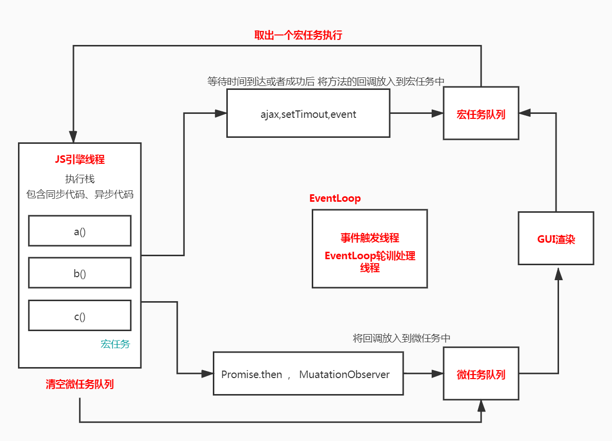

# 后端一次返回10万条数据，前端如何渲染

## 1、异步渲染 （setTimeout、requestAnimationFrame）

## 2、虚拟列表
https://github.com/bvaughn/react-window

https://react-window.now.sh/#/examples/grid/fixed-size

## 3、webWorker
http://www.ruanyifeng.com/blog/2018/07/web-worker.html

https://developer.mozilla.org/zh-CN/docs/Web/API/Web_Workers_API/Using_web_workers

### eventLoop

